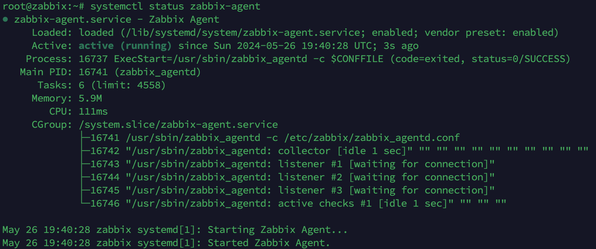
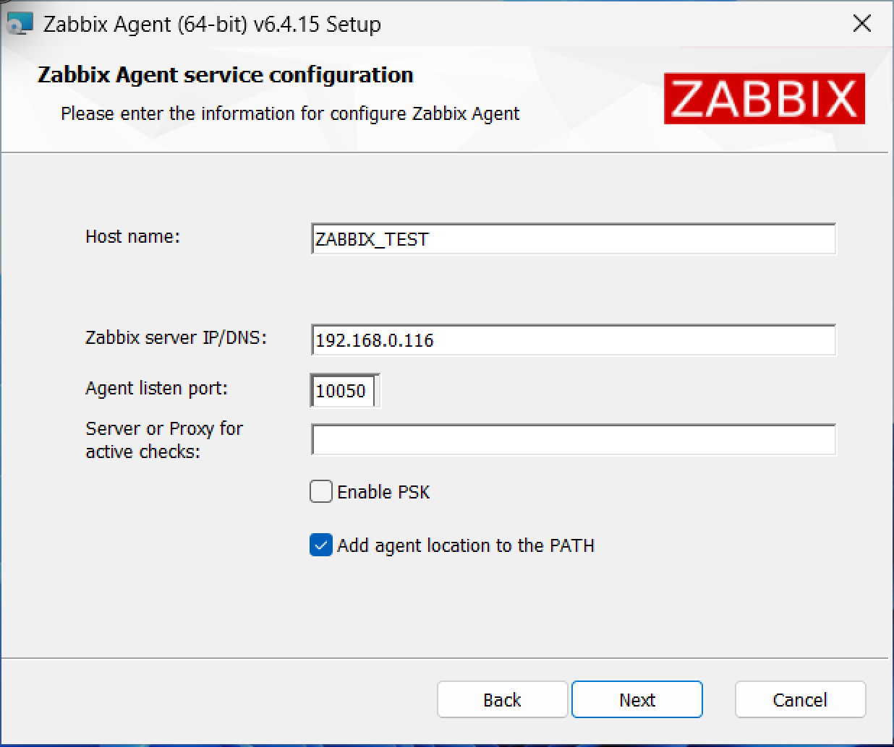
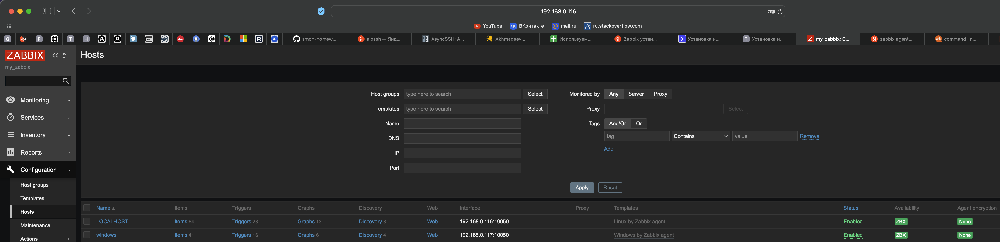
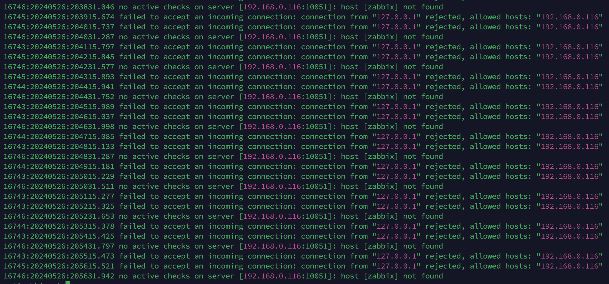
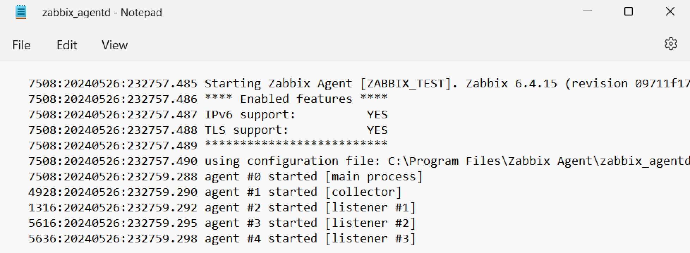
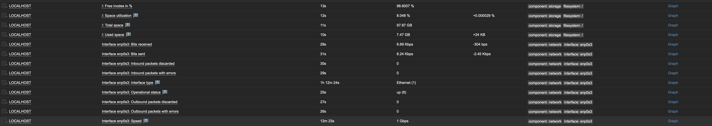
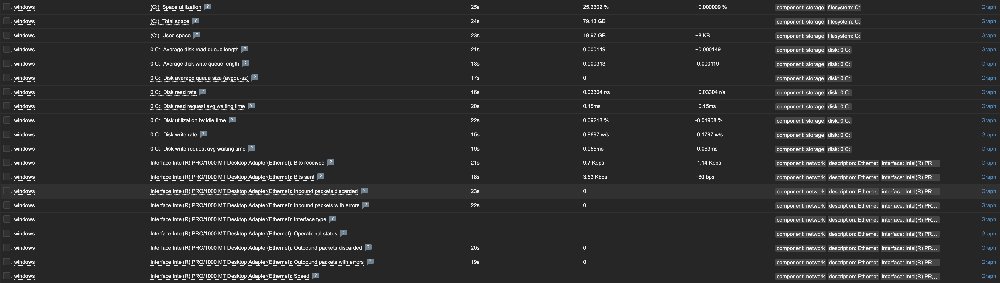

# Домашнее задание к занятию «Система мониторинга Zabbix»

---
## Ахмадеев Булат Наилевич

---

## Задание 1

Установил PostgreSQL с помощью команд (взяты из официальных источников):
```
sudo apt-get update
sudo apt-get install postgresql postgresql-contrib
```
Далее зашел под пользователем postgres:
```
sudo su - postgres
```
После чего запустил консоль Postgres:


### Далее начал установку Zabbix-сервер и Zabbix

Ниже команды для установки zabbix:
```
(Добавил официальный репозиторий Zabbix)
wget https://repo.zabbix.com/zabbix/6.0/ubuntu/pool/main/z/zabbix-release/zabbix-release_6.0-4+ubuntu22.04_all.deb

(Установил скачанный файл с помощью утилиты dpkg)
dpkg -i zabbix-release_6.0-4+ubuntu22.04_all.deb

(Установил Zabbix-сервер и его зависимости)
apt update && apt -y install zabbix-server-pgsql zabbix-frontend-php php8.1-pgsql zabbix-nginx-conf zabbix-sql-scripts zabbix-agent

(Создаю пользователя в PostgreSQL с именем zabbix)
sudo -u postgres createuser --pwprompt zabbix

(Создал базу данных с именем zabbix)
sudo -u postgres createdb -O zabbix zabbix

(Импортировал файлы, содержащие схему данных, в созданную ранее БД с именем zabbix)
zcat /usr/share/zabbix-sql-scripts/postgresql/server.sql.gz | sudo -u zabbix psql zabbix

(Открываю на редактирование файл zabbix_server.conf. Ищу параметр DBPassword и задаю пароль от БД.)
nano /etc/zabbix/zabbix_server.conf

(Открываю на редактирование файл nginx.conf. В блоке server раскомментировал параметры listen и server_name)
nano /etc/zabbix/nginx.conf

(Перезапускаю сервер Zabbix, агент Zabbix, Nginx, PHP-FPM и добавляю их в автозагрузку)
systemctl restart zabbix-server zabbix-agent nginx php8.1-fpm && systemctl enable zabbix-server zabbix-agent nginx php8.1-fpm

(Проверяю статус сервера Zabbix)
systemctl status zabbix-server
```

Статус сервера Zabbix:


Добро пожаловать в Zabbix:


Проверка пакетов:


Конфигурация подключения к БД:


Настройка Zabbix'а:


Преустановка параметров:


Установка:


Авторизация в Zabbix:


Основное меню Zabbix:


---

## Задание 2 и 3

Я подключил два агента Zabbix (Linux и Windows 11)

### Установка Zabbix-агента на Linux (Который сервер Zabbix):

```
(Добавляю официальный репозиторий Zabbix. Скачиваю пакет в формате .deb при помощи утилиты wget)
wget https://repo.zabbix.com/zabbix/6.0/ubuntu/pool/main/z/zabbix-release/zabbix-release_latest+ubuntu22.04_all.deb

(Устанавливаю скачанный файл с помощью утилиты dpkg)
dpkg -i zabbix-release_latest+ubuntu22.04_all.deb

(Обновляю списки репозиториев и устанавливаю Zabbix-агент)
apt update && apt -y install zabbix-agent

(Открываю на редактирование файл zabbix_agentd.conf. Изменяю следующие параметры: Server, ServerActive и Hostname)
nano /etc/zabbix/zabbix_agentd.conf

(После того как все необходимые изменения были внесены, перезапустил Zabbix-агент и добавил его в автозагрузку)
systemctl restart zabbix-agent && systemctl enable zabbix-agent

(Проверяю статус агента)
systemctl status zabbix-agent
```

Статус агента в Linux:



### Установка Zabbix-агента на Windows

Тут все просто, надо просто скачать установщик и указать здесь параметры:



Скриншот раздела Configuration > Hosts, где видно, что агенты подключены к серверу:



Скриншот лога zabbix agent, где видно, что он работает с сервером (Linux):



Скриншот лога zabbix agent, где видно, что он работает с сервером (Windows 11):


Преположу, что новых данных не будет, пока не убьешь процесса Agent-Zabbix, ибо я не понимаю, почему нет свежих записей, хотя Zabbix Server все видит у него.

Скриншот раздела Monitoring > Latest data для обоих хостов, где видны поступающие от агентов данные:

Linux:



Windows:


